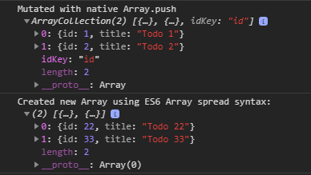

## EXPERIMENTAL - DO NOT USE IN PRODUCTION

> I realized that it is not a good idea to extend native JS Array. Native Array methods like `map` will return an Array and not ArrayCollection. The information about a custom `idKey` will be lost then.


# Ts Array Collection
[](https://github.com/spierala/ts-array-collection/actions?query=workflow%3ATests)

`ArrayCollection` extends native Javascript Array and adds additional methods to manage Array data as a Collection.

## Features
- ArrayCollection is still a native Javascript Array under the hood (all Array methods stay intact, ES6 Array spread syntax still works)
- Every ArrayCollection method returns a new ArrayCollection/Array which is useful if you need to work with immutable data
- The original ArrayCollection/Array is **not** mutated by performing the ArrayCollection methods.

## Usage

#### Create a new Array Collection:

`const collection: ArrayCollection<T> = new ArrayCollection(obj1, obj2);`

#### Update the Array Collection with following methods:

`add(item: T): ArrayCollection<T>`

`update(id: string | number, item: Partial<T>): ArrayCollection<T>`

`remove(id: string | number): ArrayCollection<T>`

`set(items: T[]): ArrayCollection<T>`

#### Update the default id key

ArrayCollection uses the `id` property of an item to perform lookups (e.g. for update/remove).

The default idKey can be adjusted:

`const collection: ArrayCollection = new ArrayCollection().setIdKey('fancyId')`

## Example
```
// Create new ArrayCollection
const initialized: ArrayCollection<Todo> = new ArrayCollection({
  id: 1,
  title: 'Todo 1'
});

// Add new item
const added: ArrayCollection<Todo> = initialized.add({
  id: 2,
  title: 'Todo 2'
});

// Update item by Id
const updated: ArrayCollection<Todo> = added.update(2, {
  desc: 'Updated Desc'
});

// Remove item by Id
const removed: ArrayCollection<Todo> = updated.remove(2);

// Replace current collection with the provided collection
const afterSet: ArrayCollection<Todo> = updated.set([
  {
    id: 3,
    title: 'Todo 3'
  },
  {
    id: 4,
    title: 'Todo 4'
  }
]);

console.log('INITIALIZED\n', initialized);
console.log('ADDED\n', added);
console.log('UPDATED\n', updated);
console.log('REMOVED\n', removed);
console.log('AFTERSET\n', afterSet);
```
Console output:


#### Play with the native Array functionality of ArrayCollection:
```
const arrayCollection: ArrayCollection<Todo> = new ArrayCollection({
  id: 1,
  title: 'Todo 1'
});
// Mutate the ArrayCollection/Array with native JS Array.push
arrayCollection.push({
  id: 2,
  title: 'Todo 2'
});
console.log('Mutated with native Array.push\n', arrayCollection);

// ES6 Array Spread syntax
const arrayCollection2: ArrayCollection<Todo> = new ArrayCollection({
  id: 22,
  title: 'Todo 22'
});
const newArray: Todo[] = [...arrayCollection2, {id: 33, title: 'Todo 33'}];
console.log('Created new Array using ES6 Array spread syntax: \n', newArray);
```

Console output:



## License

MIT

## Created By

If you like this, follow [@spierala](https://twitter.com/spierala) on twitter.

