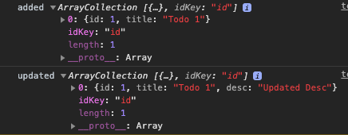

# Ts Array Collection
[](https://www.npmjs.com/package/ts-array-collection)

`ArrayCollection` extends native Javascript Array and adds additional methods to manage Array data as a collection.

## Features
- ArrayCollection is still a native Javascript Array under the hood (all Array methods stay intact, ES6 Array spread syntax still works)
- Every ArrayCollection method returns a new ArrayCollection/Array which is useful if you need to work with immutable data 

## Usage

Create a new Array Collection:

`const collection: ArrayCollection<T> = new ArrayCollection(obj1, obj2);`

Update Arrays with following methods:

`add(item: T): ArrayCollection<T>`

`update(item: T): ArrayCollection<T>`

`remove(id: string | number): ArrayCollection<T>`

`set(items: T[]): ArrayCollection<T>`

## Example
```
import { ArrayCollection } from 'ts-array-collection';

class Todo {
  id: number;
  title: string;
  desc?: string;
}

const collection: ArrayCollection<Todo> = new ArrayCollection();
const added: ArrayCollection<Todo> = collection.add({
  id: 1,
  title: 'Todo 1'
});

console.log('added', added);

const updated: ArrayCollection<Todo> = collection.update({
  id: 1,
  title: 'Todo 1',
  desc: 'Updated Desc'
});

console.log('updated', updated);
````

Console output:


