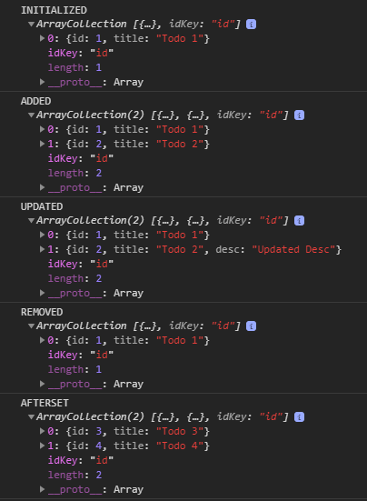

# Ts Array Collection
[](https://www.npmjs.com/package/ts-array-collection)

Draft of an Array Collection.
Stop using Array `filter`, `map` to update Array Data.

## Usage

Array Collection extends native Javascript Array and adds methods to easily update the Array Data.
Each method returns a new Array.

Update Arrays with following methods:

`add`

`update`

`delete`

`set`

## Example
```
import { ArrayCollection } from 'ts-array-collection';

class Todo {
  id: number;
  title: string;
  desc?: string;
}

const collection: ArrayCollection<Todo> = new ArrayCollection();
const added: ArrayCollection<Todo> = collection.addItem({
  id: 1,
  title: 'Todo 1'
});

console.log('added', added);

const updated: ArrayCollection<Todo> = collection.update({
  id: 1,
  title: 'Todo 1',
  desc: 'Updated Desc'
});

console.log('updated', updated);
```

